# Vivacon — Kiến trúc & luồng end-to-end (Vercel + Supabase + VM)

Tài liệu này mô tả **toàn bộ đường đi của một request**, từ trình duyệt người dùng cho
tới một hàng trong Postgres, trên đúng topology đang chạy: frontend trên Vercel,
backend trong Docker trên một VM Ubuntu, database trên Supabase, và Cloudflare Tunnel
làm lớp vào HTTPS.

Nó trả lời ba câu hỏi: *cái gì chạy ở đâu*, *ai nói chuyện với ai qua giao thức nào*,
và *cấu hình nào quyết định điều đó*. Lịch sử quá trình deploy nằm ở
`.kiro/steering/deployment.md`; file này là ảnh chụp kiến trúc.

---

## 1. Tóm tắt một đoạn

Vivacon là một ứng dụng mạng xã hội kiểu Instagram: **Spring Boot 2.5 (Java 11)** cung
cấp REST API và một broker STOMP-over-WebSocket, **React 17 (CRA)** là single-page app
tiêu thụ cả hai. Trạng thái bền vững nằm ở **PostgreSQL**; ảnh nằm ở **Cloudinary/S3**;
email đi qua **Microsoft Graph REST API**.

Điểm đáng chú ý nhất về kiến trúc triển khai là nó **không đồng nhất một chỗ**: ba tầng
nằm trên ba nhà cung cấp khác nhau, ở ba vùng địa lý khác nhau, nối với nhau bằng hai
đường HTTPS công khai. Phần lớn sự phức tạp trong tài liệu này sinh ra từ đúng một sự
thật: Vercel chỉ phục vụ HTTPS, còn VM nằm sau NAT ở địa chỉ riêng.

---

## 2. Topology đang chạy

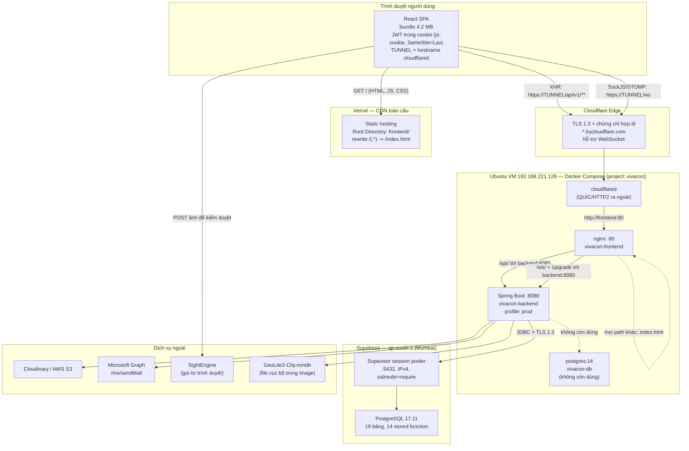

### Vì sao đường đi lại vòng như vậy

Cách hiển nhiên là để Vercel proxy `/api` về backend. Nó **không khả thi**, vì ba lý do
độc lập:

1. Trang phục vụ từ `https://...vercel.app` không gọi được `http://192.168.221.128` —
   trình duyệt chặn mixed content.
2. Edge của Vercel cũng không với tới `192.168.221.128` được, nên rewrite ở phía Vercel
   không giải quyết gì.
3. **Vercel không giữ được kết nối WebSocket.** Function của nó không phục vụ cho mô
   hình kết nối dài, nên `/ws` không bao giờ proxy qua Vercel được. SockJS buộc phải
   nối thẳng vào backend.

Ba lý do, cùng một kết luận: backend cần một hostname HTTPS công khai với chứng chỉ
được tin cậy. Một IP sau NAT không xin được chứng chỉ. Cloudflare Tunnel giải quyết
chuyện đó mà không cần IP tĩnh, không cần mở cổng router, và nó **carry được WebSocket**.

Chi tiết quan trọng: tunnel trỏ vào **nginx**, không trỏ vào backend. nginx đã proxy sẵn
`/api` và `/ws`, nên một hostname duy nhất phục vụ được cả static, API và WebSocket.

---

## 3. Vai trò từng thành phần

| Thành phần | Chạy ở đâu | Trách nhiệm | Không chịu trách nhiệm |
|---|---|---|---|
| Vercel | CDN toàn cầu | Phục vụ bundle tĩnh, SPA fallback | Không có API, không có WebSocket, không biết gì về backend |
| Cloudflare Tunnel | container trong VM | TLS, hostname công khai, đi xuyên NAT | Không routing theo path, không auth |
| nginx | container trong VM | Routing `/api` + `/ws`, SPA fallback, gzip, cache `/static/` | Không xử lý business logic, không terminate TLS |
| Spring Boot | container trong VM | REST API, STOMP broker, JWT, phân quyền, nghiệp vụ | Không phục vụ file tĩnh của SPA |
| Supabase | ap-south-1 | Lưu trữ, 14 stored function cho thống kê | Không có auth của Supabase — app tự quản JWT |
| Cloudinary / S3 | SaaS | Lưu ảnh attachment | — |
| Microsoft Graph | SaaS | Gửi email xác thực | — |
| SightEngine | gọi từ **trình duyệt** | Kiểm duyệt ảnh trước khi upload | Không phải một chốt chặn phía server |

> **Lưu ý về kiểm duyệt ảnh:** SightEngine được gọi từ frontend, nên nó là trợ giúp UX
> chứ **không phải** kiểm soát bảo mật. Một client tự viết có thể bỏ qua hoàn toàn bước
> này. Backend không kiểm duyệt lại.

---

## 4. Luồng build và deploy

Ba tầng được deploy bằng ba cơ chế khác nhau, và **thứ tự giữa chúng là bắt buộc**.

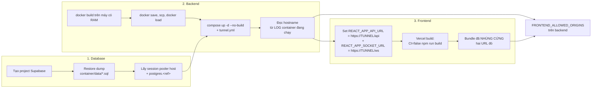

### Bất biến quan trọng nhất của cả hệ

> `REACT_APP_*` được **nhúng vào bundle lúc build**, không đọc được lúc runtime.

Kéo theo hai hệ quả mà không cách nào lách được:

- Hostname tunnel **phải tồn tại trước** khi Vercel build.
- Tunnel đổi hostname ⇒ **phải redeploy Vercel**, không chỉ sửa biến môi trường.

Ngược lại, `FRONTEND_ALLOWED_ORIGINS` của backend được đọc **lúc khởi động**, nên nó chỉ
cần một lần restart. Sự bất đối xứng này là lý do bước 2 phải xong trước bước 3.

### Vì sao image được build ở nơi khác rồi mới chuyển sang

VM có ~1.3 GB RAM trống. Một lần webpack build của CRA thường cần 2–4 GB, nên trên máy
đó nó sẽ thrash swap hoặc bị OOM-kill. `docker-compose.yml` khai báo `image:` chính là
để `up` **dùng lại** image đã nạp thay vì build; `--no-build` biến điều đó thành đảm bảo
chứ không phải hy vọng.

### Vì sao build trên Vercel phải là `CI=false`

Vercel set `CI=1`, và Create React App biến **mọi warning thành error** khi `CI` được
set. Dự án hiện có **412 ESLint warning**. Đo được: `CI=true` thoát mã 1 và không để lại
bundle dùng được; `CI=false` thoát 0 và cho ra ~20 MB output. Đó là lý do
`frontend/vercel.json` ghi `"buildCommand": "CI=false npm run build"`.

Đây là **nợ kỹ thuật được che lại**, không phải một bước deploy hợp lệ. Trong 412 warning
đó có 20 cái `jsx-a11y/alt-text` — một khoảng trống accessibility thật.

---

## 5. Luồng tải trang đầu tiên

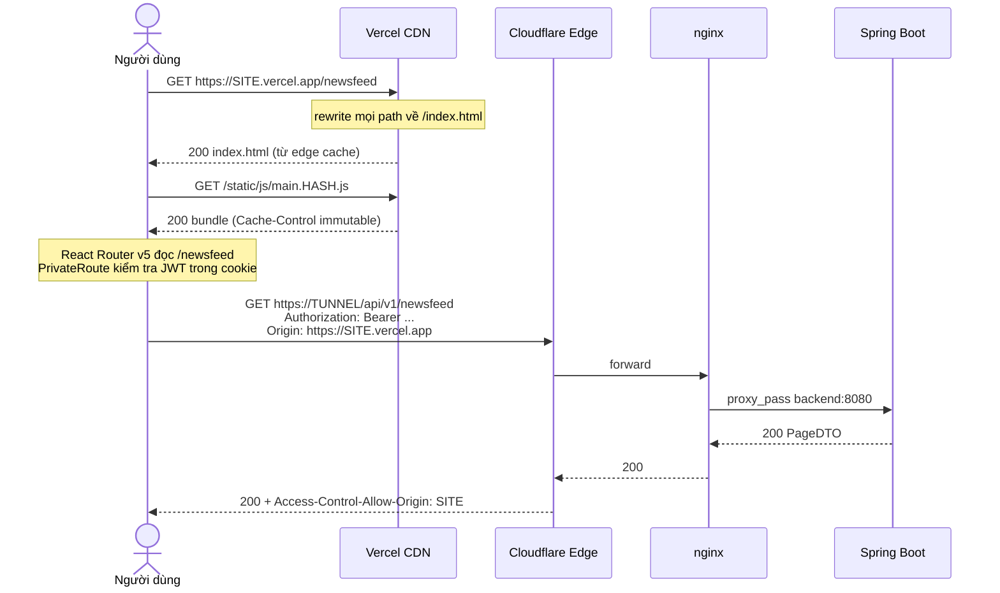

Hai điểm dễ bị hiểu sai ở đây.

**`https://<site>.vercel.app/api/v1/post` trả về 200 với HTML, không phải 404.** Catch-all
rewrite làm việc đó. Nên nếu hai biến `REACT_APP_*` bị thiếu, axios nhận HTML và báo
`Unexpected token <` — một thông báo lỗi không hề trỏ về nguyên nhân thật.

**`/actuator/health` không phơi ra ngoài.** nginx chỉ proxy `/api` và `/ws`, nên
`https://<tunnel>/actuator/health` rơi vào SPA fallback và trả index.html. Health chỉ
tới được từ healthcheck nội bộ của container.

---

## 6. Luồng xác thực

### 6.1 Đăng nhập

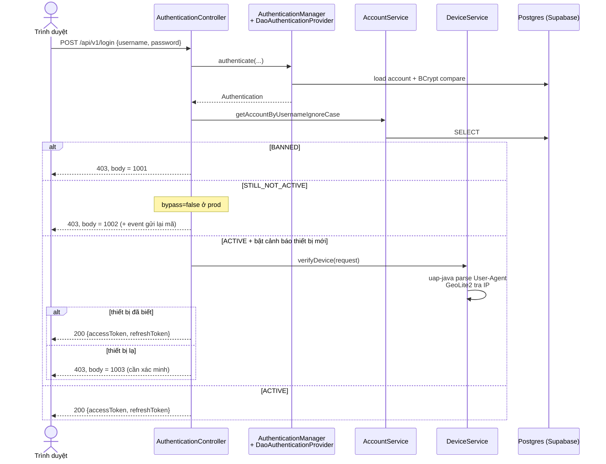

Mã nghiệp vụ `1001` / `1002` / `1003` được trả **trong body** cùng status 403, và
`LoginPage` ở frontend đọc đúng ba mã đó. Đây là một quy ước riêng của dự án, không phải
chuẩn HTTP — ai sửa `GlobalExceptionHandler` cần biết.

### 6.2 Token đi đâu, và vì sao `SameSite=None` không liên quan

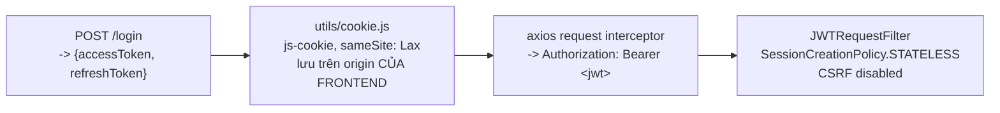

Một ngộ nhận phổ biến đã được bác bỏ bằng cách đọc code: **hệ này không xác thực bằng
cookie cross-origin.** Cookie chỉ là nơi lưu trữ phía client, nằm trên origin của
frontend và **không bao giờ được gửi sang** origin của backend. Token được interceptor
**copy** vào header `Authorization`. Vì vậy `SameSite=None` và `Secure` không ảnh hưởng
gì tới việc đăng nhập cross-origin có chạy hay không.

`withCredentials: true` vẫn được set trên axios instance và không mang lại gì ở đây, vì
origin backend không có cookie nào để gửi. Nó có **một** tác dụng thật: buộc preflight
phải nhận `Access-Control-Allow-Credentials: true` và một `Access-Control-Allow-Origin`
**cụ thể, không được là wildcard**. Đó chính là lý do danh sách origin phải chính xác.

HTTPS vẫn bắt buộc — nhưng vì mixed content và `wss`, không vì cookie.

Một điểm còn hở: `cookieConfig` trong `utils/cookie.js` đặt `path`, `sameSite: 'Lax'` và
`expires: 30` nhưng **không đặt `secure`**. Site đang chạy HTTPS nên trong thực tế cookie
không đi qua kết nối plaintext, nhưng cờ đó là thứ miễn phí và nên có. Hạn 30 ngày của
cookie cũng dài hơn hạn của refresh token (100 giờ), nên sau khi refresh token chết thì
cookie vẫn còn và luồng ở mục 6.3 sẽ rơi vào nhánh `reload()`.

### 6.3 Làm mới token khi 401

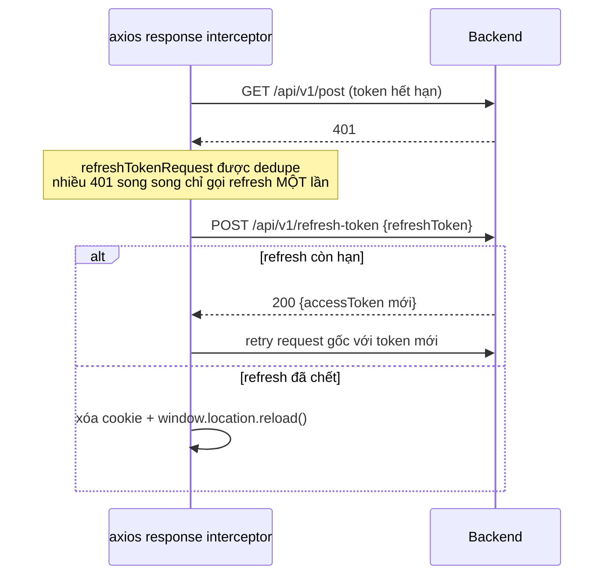

Access token sống 1 giờ (`jwt_validity: 36000000`), refresh token 100 giờ
(`refresh_expiration: 360000000`).

---

## 7. Luồng realtime (chat + notification)

Đây là phần mà topology gây nhiều hệ quả nhất, vì WebSocket **không thể** đi qua Vercel.

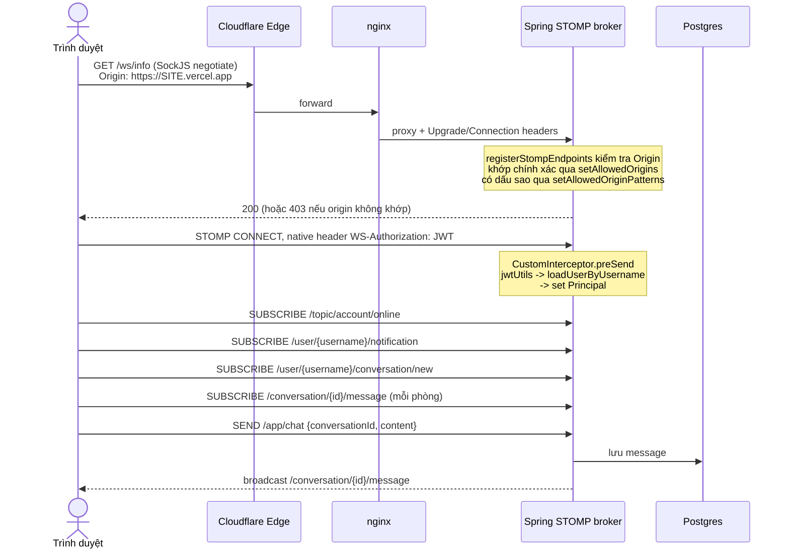

Ba chi tiết cấu hình, mỗi cái gây một kiểu lỗi khác nhau:

- **Auth qua STOMP dùng native header `WS-Authorization`**, không phải `Authorization`.
  Hằng số là `Constants.STOMP_AUTHORIZATION_HEADER`.
- **nginx bắt buộc phải forward `Upgrade` và `Connection`.** Thiếu là SockJS không bắt
  tay được, và lỗi đó **im lặng**.
- **Pattern origin phải đi qua `setAllowedOriginPatterns`.** `setAllowedOrigins` so khớp
  **nguyên văn**, nên nhét `https://*.vercel.app` vào đó thì nó đem cả dấu `*` đi so với
  header `Origin` và không bao giờ khớp. Nếu để nguyên, Vercel sẽ tạo ra kiểu lỗi tệ
  nhất: API chạy, trang tải bình thường, chỉ chat và notification là chết.

Đo được qua tunnel:

| `Origin` | `/ws/info` |
|---|---|
| chính hostname tunnel | 200 |
| `https://vivacon-demo.vercel.app` | 200 |
| `https://abc-git-main-x.vercel.app` (dạng preview) | 200 |
| `https://evil.example.com` | 403 |
| `https://vercel.app.evil.com` | **403** |

Dòng cuối là dòng đáng giữ. Một cách làm ngây thơ chỉ tìm chuỗi con `vercel.app` sẽ chấp
nhận một domain do kẻ tấn công kiểm soát.

---

## 8. Biên bảo mật và CORS

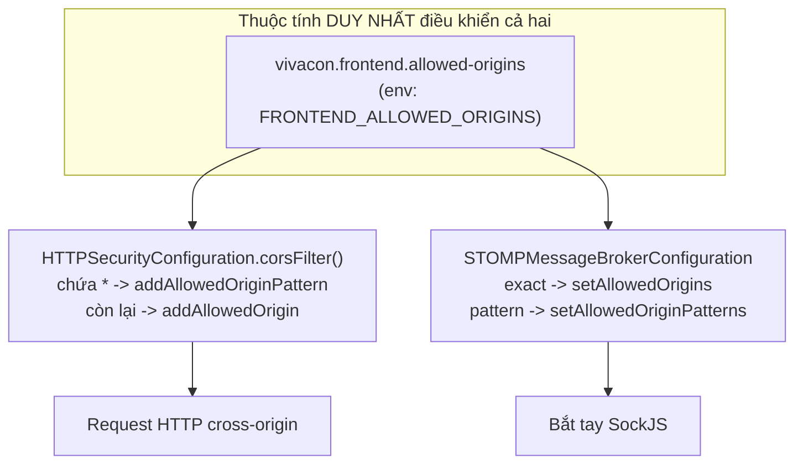

Một thuộc tính, hai nơi đọc. Đặt sai thì **cả** API **và** socket cùng báo lỗi, chứ
không phải một cái chạy một cái chết — đó là lựa chọn có chủ ý, vì kiểu lỗi nửa sống nửa
chết là kiểu tốn thời gian nhất.

Ba origin hiện được cho phép:

```
http://192.168.221.128          # LAN, để debug
https://<tunnel-host>           # chính hostname tunnel
https://*.vercel.app            # production + mọi preview deployment
```

### Phân quyền trong Spring Security

```
URL_WHITELIST                       -> permitAll (login, registration, Swagger, /ws/**)
/actuator/**                        -> permitAll  ⚠ xem ghi chú
/api/v1/admin/**                    -> hasAnyAuthority(ADMIN, SUPER_ADMIN)
POST /api/v1/account/password       -> permitAll (quên mật khẩu)
DELETE /api/v1/comment/{id}         -> @resourceRestrictionService.isAccessibleToCommentResource
DELETE /api/v1/post/{id}            -> @resourceRestrictionService.isAccessibleToPostResource
/api/v1/conversation/{id}/messages  -> @resourceRestrictionService.isAccessibleToConversationResource
còn lại                             -> authenticated()
```

`/actuator/**` là `permitAll` ở tầng Spring. Hiện tại nó không gây rủi ro **chỉ vì**
nginx không proxy path đó ra ngoài. Đó là an toàn nhờ cấu hình hạ tầng, không phải nhờ
cấu hình ứng dụng — nếu sau này có ai trỏ tunnel thẳng vào backend hoặc thêm một
`location /actuator/` vào nginx, actuator sẽ phơi ra ngay mà không có cảnh báo nào.

### TLS kết thúc ở đâu

| Chặng | Mã hóa |
|---|---|
| Trình duyệt → Vercel | HTTPS (Vercel quản chứng chỉ) |
| Trình duyệt → Cloudflare Edge | TLS 1.3, chứng chỉ Google Trust Services cho `trycloudflare.com` |
| Cloudflare Edge → cloudflared | đường hầm của Cloudflare (QUIC, đã thấy đi qua `sin07`) |
| cloudflared → nginx → backend | **HTTP thuần**, nhưng chỉ trong mạng nội bộ của Docker |
| backend → Supabase pooler | TLS 1.3, `TLS_AES_256_GCM_SHA384` |

**`sslmode=require` ở connection string là load-bearing.** Đã đo: pooler cũng chấp nhận
`sslmode=disable`. Endpoint không tự cưỡng chế mã hóa, nên bỏ tham số đó đi là để một
cấu hình sai chạy plaintext qua Internet công khai mà không có gì phản đối.

Ngược lại, `pg_stat_ssl` báo `ssl = false` và điều đó **không đáng lo**: nó mô tả chặng
*Supavisor → Postgres* bên trong mạng Supabase, không phải chặng từ đây.

---

## 9. Kiến trúc backend

Backend phân lớp theo **mối quan tâm kỹ thuật**, không theo feature.

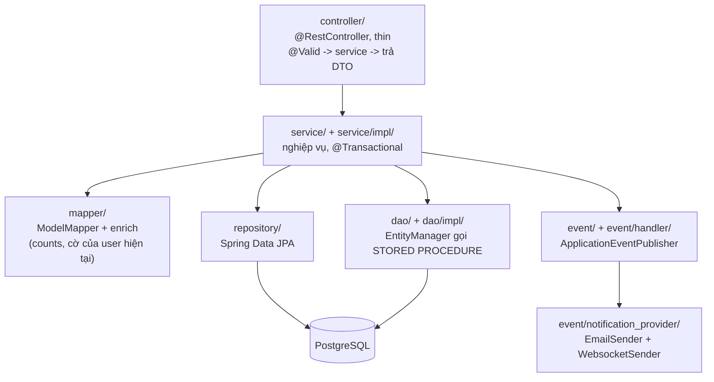

Các quy ước mà code hiện tại tuân thủ:

- Constructor injection, không `@Autowired` trên field.
- Controller mỏng: validate, gọi service, trả DTO trực tiếp (không bọc `ResponseEntity`
  trừ khi không có body) — `AuthenticationController` là ngoại lệ, vì nó cần trả mã
  nghiệp vụ kèm status.
- Entity kế thừa `AuditableEntity` (`createdBy`, `createdAt`, `lastModifiedBy`,
  `lastModifiedAt`, `active`). **Xóa là xóa mềm** — chỉ đổi `active`.
- POJO viết tay, getter/setter tường minh, **không Lombok**.
- Side effect (notification, email, hậu xử lý report) đi qua
  `ApplicationEventPublisher` + handler trong `event/handler/`, không nhúng inline trong
  service.
- Thống kê thuộc về `dao/`, gọi stored function, **không** nằm ở JPA repository.

### Phân lớp của frontend

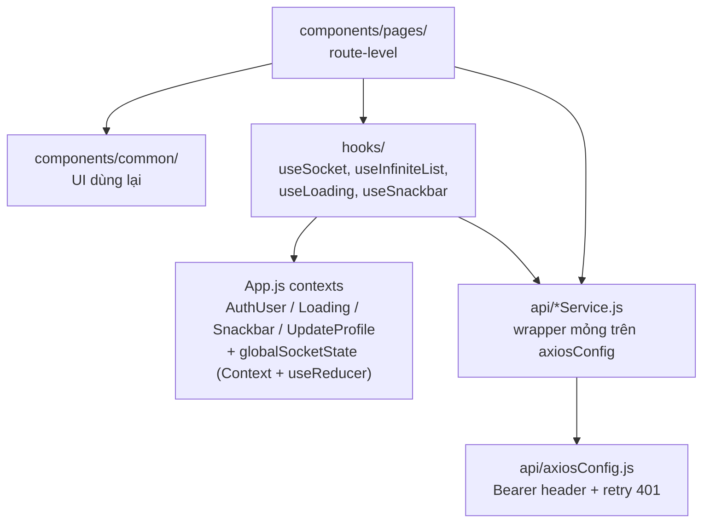

`redux`, `react-redux`, `redux-saga`, `redux-persist` **có trong `package.json` nhưng
không được dùng**. State dùng chung đi qua Context + `useReducer`. Đừng thêm Redux vào.

---

## 10. Tầng dữ liệu

### Cấu trúc

19 base table + **3 view rác** (`month_year`, `quarter_year`, `list_year`) + 14 stored
function. Dữ liệu seed: 54 account, 688 post, 30.552 comment, 1.073 attachment.

**`schema.sql` không đủ để dựng schema.** Nó tạo đúng 11 bảng; 8 bảng còn lại
(`device_metadata`, `hashtag`, `hashtag_rel_post`, `notification`, `account_report`,
`post_report`, `comment_report`, `report_template`) chỉ tồn tại vì Hibernate
`ddl-auto: update` tạo chúng lúc boot. Hệ quả thấy được: hàm
`getlastestloginlocationperaccount()` lỗi `relation "device_metadata" does not exist` nếu
schema chỉ dựng từ `schema.sql`.

Vì vậy đường đi đúng để khởi tạo một database mới là **restore dump** từ
`container/data/*.sql`, không phải chạy init script.

### Kết nối Supabase

```
SPRING_DATASOURCE_URL=jdbc:postgresql://aws-0-<region>.pooler.supabase.com:5432/postgres?sslmode=require
DB_USERNAME=postgres.<project-ref>
DB_PASSWORD=<database password>
```

Ba chi tiết, mỗi cái gây một kiểu lỗi khác nhau:

- **Session mode (5432), không phải transaction mode (6543).** Transaction pooling ghép
  nhiều client lên một connection và làm vỡ server-side prepared statement — thứ mà
  Hibernate dùng rất nhiều. Nếu buộc phải dùng 6543 thì thêm `prepareThreshold=0`.
- **`DB_USERNAME` phải tách ra được.** Pooler cần `postgres.<project-ref>`.
- **Connection trực tiếp của Supabase không dùng được ở đây.** Host đó chỉ có record
  AAAA, mà VM này **không có IPv6** (đã đo: không có global address, không có default
  route, `curl -6` im lặng cả trên host lẫn trong container). Pooler phân giải ra IPv4
  `65.0.195.55`, nên nó chạy. DNS vẫn trả AAAA, nên lỗi sẽ **trông như treo**, không
  giống lỗi DNS.

### Độ trễ là chi phí thật, và nó lớn

| Đo được với ap-south-1 | |
|---|---|
| Mở session mới (TLS + auth qua pooler) | ~790 ms |
| 20 query trong cùng một session | 2810 ms ⇒ **~105 ms mỗi round trip** |
| `count(*)` trên 30.552 comment | 726 ms, gần hết là setup session |
| `/api/v1/account/check` qua proxy | **328 ms** (≈ 3 round trip) |
| Cùng endpoint, Postgres cục bộ | **5 ms** |

Database không chậm; **khoảng cách** mới chậm. HikariPool giữ connection mở nên request
tránh được 790 ms bắt tay. Nhưng phép tính này không khoan nhượng với bất cứ thứ gì
"chatty": một mapper enrich từng item trong page bằng query riêng sẽ biến một newsfeed 10
item thành vài chục round trip và vài giây wall time.

> Phần newsfeed là **suy ra** từ con số 105 ms, không phải đo trực tiếp — các endpoint
> phân trang cần token và không có credential để đăng nhập lúc đo.

**ap-south-1 là Mumbai**, nằm sai phía vịnh Bengal so với Việt Nam. `ap-southeast-1`
(Singapore) sẽ cắt đáng kể round trip. Region không đổi được trên project Supabase đã
tạo, nên muốn cải thiện thì phải tạo project mới và restore lại dump.

---

## 11. Bản đồ cấu hình

Cùng một giá trị có thể đến từ nhiều nguồn. Thứ tự ưu tiên và nơi đặt:

| Giá trị | Nguồn khi deploy | Đọc lúc nào | Đổi thì phải làm gì |
|---|---|---|---|
| `REACT_APP_API_URL` | Vercel Project Settings | **build time** | **Redeploy Vercel** |
| `REACT_APP_SOCKET_URL` | Vercel Project Settings | **build time** | **Redeploy Vercel** |
| `FRONTEND_ALLOWED_ORIGINS` | `.env` của VM | startup | `up -d backend` |
| `SPRING_DATASOURCE_URL` | `.env` / `config/supabase.env` | startup | restart backend |
| `DB_USERNAME` / `DB_PASSWORD` | `config/supabase.env` (gitignored) | startup | restart backend |
| `JWT_SECRET_SALT` | `.env` của VM, sinh bằng `openssl rand` **trong VM** | startup | restart + mọi token cũ chết |
| `BACKEND_ORIGIN` | compose, cố định `backend:8080` | nginx startup | restart frontend |
| `TUNNEL_COMMAND` | `.env`, mặc định quick tunnel | container start | **đổi hostname** |

Vài nguyên tắc đã được áp dụng và nên giữ:

- **Secret không nằm trong YAML được git track.** Mọi credential ở đó là placeholder
  rỗng kiểu `${DB_PASSWORD:}`. Giá trị thật nằm trong `./config/` (gitignored) hoặc biến
  môi trường.
- **Secret được sinh *trong* VM**, bằng `openssl rand -base64` ghi thẳng vào `.env`, rồi
  `chmod 600`. Một giá trị đánh vào command line trên máy host sẽ nằm trong shell
  history, trong process list, và trong transcript của người chạy nó.
- **Credential Supabase truyền dạng biến libpq rời, không phải URI.** Mật khẩu chứa `@`,
  `:`, `/`, `?` hay `#` không cần URL-encode theo cách đó, và `--env-file` giữ mật khẩu
  khỏi mọi command line.
- **Compose dùng `${VAR:?}` cho `DB_PASSWORD` và `JWT_SECRET_SALT`**, nên thiếu là dừng
  ngay thay vì khởi động với cấu hình nửa vời.

### Hai file compose, và sự khác biệt rất quan trọng

```bash
docker compose up -d                        # DEV: tự nạp override.yml
docker compose -f docker-compose.yml up -d  # DEPLOY: override bị bỏ qua
```

`docker-compose.override.yml` mở cổng database, mở cổng backend, và thêm Adminer. **Cả
ba đều là thứ không nên tồn tại trên một host công khai.** Chỉ định `-f` tường minh là
cách duy nhất chặn override được nạp.

Ở chế độ deploy, **chỉ frontend publish cổng**:

| Service | Cổng dev | Deploy |
|---|---|---|
| `frontend` | 8081 | 80 |
| `backend` | 8091 | không |
| `db` | 5433 | không |
| `adminer` | 8901 | không có |

Tunnel là file thứ ba, cũng phải chỉ định tường minh:

```bash
docker compose -f docker-compose.yml -f docker-compose.tunnel.yml up -d
```

Phơi một stack ra Internet phải là một hành động có ý, không phải thứ mà `up` mặc định
tự làm.

---

## 12. Tình trạng hiện tại, đo lúc viết tài liệu

| Kiểm tra | Kết quả |
|---|---|
| `https://viva-spring-reactjs-five.vercel.app/` | **200** — frontend sống |
| Hostname trong `config/tunnel-url.txt` | **không phân giải được** — quick tunnel đã đổi hostname |

Nghĩa là **site đang sống nhưng API phía sau nó thì không**: bundle đã deploy nhúng cứng
một hostname tunnel đã chết, nên trang sẽ tải được và mọi lệnh gọi API sẽ thất bại.

Đây đúng là chế độ hỏng mà `docker-compose.tunnel.yml` đã cảnh báo, và nó không phải lỗi
cấu hình — nó là bản chất của quick tunnel. Để trở lại trạng thái chạy:

1. Đọc hostname mới từ **log của container `cloudflared` đang chạy**, không đọc từ
   `config/tunnel-url.txt`.
2. Cập nhật `FRONTEND_ALLOWED_ORIGINS` rồi `up -d backend` (chỉ backend — recreate
   `cloudflared` sẽ lại đổi hostname).
3. Cập nhật hai biến `REACT_APP_*` trên Vercel và **redeploy**.

Script `config/vm-tunnel-origins.sh` làm bước 1–2.

Cách thoát khỏi vòng lặp này là **named tunnel**: `TUNNEL_TOKEN` cộng
`TUNNEL_COMMAND=tunnel run`, với một domain thật. Cần một tài khoản Cloudflare.

---

## 13. Những điểm yếu kiến trúc đã biết

Xếp theo mức độ nghiêm trọng, không theo độ dễ sửa.

**1. Credential cũ còn trong git history của một repo public.** Xóa khỏi file hiện tại
không hoàn tác được điều đó. Phải **rotate** ở AWS, Cloudinary, mail provider và
Postgres. Một instance đang deploy dùng chúng là một instance có mật khẩu đã công khai.

**2. Stored function thống kê không an toàn khi gọi đồng thời.**
`postQuantityStatisticInRecentMonths`, `postQuantityStatisticInQuarters`,
`userQuantityStatisticInRecentMonths` và các hàm cùng họ đều **DROP rồi CREATE lại một
view PERMANENT** trong `public` ngay đầu mỗi lần gọi. Hai request dashboard đến cùng lúc
trên hai connection khác nhau sẽ đua trên cùng cái view, biểu hiện là
`relation does not exist` hoặc lỗi dependency — **không bao giờ reproduce được theo yêu
cầu**. Các view đó chỉ sinh một bảng lịch 12 / 4 / 2 dòng từ một danh sách `VALUES`, nên
cách sửa là inline chúng thành CTE và xóa view đi. Bằng chứng rõ nhất rằng chúng không
phải view tạm: `pg_dump` bắt được chúng và chúng đã theo dump sang Supabase.

**3. Hostname tunnel là ephemeral**, và vì `REACT_APP_*` nhúng lúc build, mỗi lần đổi
hostname là một lần redeploy frontend. Xem mục 12.

**4. ~105 ms mỗi round trip tới Supabase.** Endpoint query một lần thì ổn; thứ gì query
theo từng item trong list sẽ cảm nhận rõ.

**5. 412 ESLint warning** buộc build phải chạy `CI=false`. 347 cái là `no-unused-vars`,
nhưng 20 cái là `jsx-a11y/alt-text` — khoảng trống accessibility thật.

**6. `package-lock.json` bị gitignore theo chủ ý của dự án**, nên resolution của
dependency không reproducible giữa các máy. Khối `overrides` (ghim `react-konva` vào
đúng prerelease `17.0.2-6`) là thứ duy nhất đang giữ cây dependency không vỡ. **Đừng nới
nó thành caret range** — dòng React 17 không có bản release thường.

**7. Kiểm duyệt ảnh chỉ ở client.** SightEngine được gọi từ trình duyệt; backend không
kiểm tra lại.

**7b. Cookie JWT thiếu cờ `secure`** và có hạn 30 ngày, dài hơn hạn 100 giờ của refresh
token. Xem mục 8.

**8. `/actuator/**` là `permitAll` ở tầng Spring**, hiện an toàn chỉ nhờ nginx không
proxy path đó.

**9. Không có TLS do mình sở hữu.** Chứng chỉ hiện do Cloudflare cấp cho một hostname
tạm. Không có firewall nào được cấu hình trong VM (`ufw` chưa chạm tới).

**10. Backup chưa phải chiến lược.** `container/data/` là tiện lợi cho developer, không
phải backup.

**11. Những thứ đã chết nhưng còn trong repo:** service `db` trong compose (backend đã
chạy trên Supabase — đã chứng minh bằng cách **tắt `vivacon-db`** và thấy
`/api/v1/account/check` vẫn trả 200); Maven profile `prod` build frontend từ
`../Vivacon-UI`, một thư mục không tồn tại; starter `spring-boot-starter-mail` (email đi
qua Graph REST); `frontend/.env.production` còn trỏ `http://vivacon.cf`, một domain đã
chết.

**12. Email chưa gửi được** cho tới khi `MS_OAUTH_*` được điền. Mailbox là tài khoản
Microsoft cá nhân nên không dùng được `client_credentials`; refresh token phải lấy một
lần qua browser consent. SMTP basic auth đã chết hẳn (test trực tiếp trả `535 5.7.3`).

**13. Vercel tự chèn 18 biến của nó vào bundle.** Với preset CRA nó đặt tiền tố
`REACT_APP_`, và CRA inline mọi thứ có tiền tố đó — nên bundle công khai chứa
`REACT_APP_VERCEL_GIT_COMMIT_AUTHOR_NAME`, `..._AUTHOR_LOGIN`, `..._REPO_OWNER`,
`..._PROJECT_ID`, `..._DEPLOYMENT_ID`, commit SHA và cả commit message. Không có
credential, và repo này vốn đã public, nên tác động thực tế nhỏ — nhưng trên một repo
private thì đây là rò rỉ tên tác giả và internal ID thật. Tắt được ở *Project Settings →
Environment Variables → Automatically expose System Environment Variables*.

---

## 14. Đánh giá: Vercel có đáng không

Đáng ghi lại vì câu trả lời không hiển nhiên.

**App đã chạy đầy đủ trên HTTPS tại chính hostname tunnel**, do nginx phục vụ: cùng một
origin cho mọi thứ, không có CORS nào dính vào, không phải build lại khi bất cứ gì dịch
chuyển.

Vercel mua được đúng một thứ: **phân phối static**. Bundle nặng **4.2 MB** và Cloudflare
trả `cf-cache-status: DYNAMIC` cho nó — quick tunnel không cache gì, nên mọi khách truy
cập kéo 4.2 MB đó từ VM qua một đường mạng gia đình. CDN của Vercel sẽ cache và phục vụ
từ edge gần người dùng.

Giá phải trả là toàn bộ mục 5–8 của tài liệu này: frontend chuyển sang origin khác, nên
bundle cần URL tuyệt đối, backend cần danh sách origin chính xác, WebSocket không proxy
được, và hostname tunnel đổi là phải rebuild.

Đáng, nếu có người dùng thật. Không đáng, nếu chỉ để chứng minh stack chạy được.

---

## 15. Tái tạo từ đầu

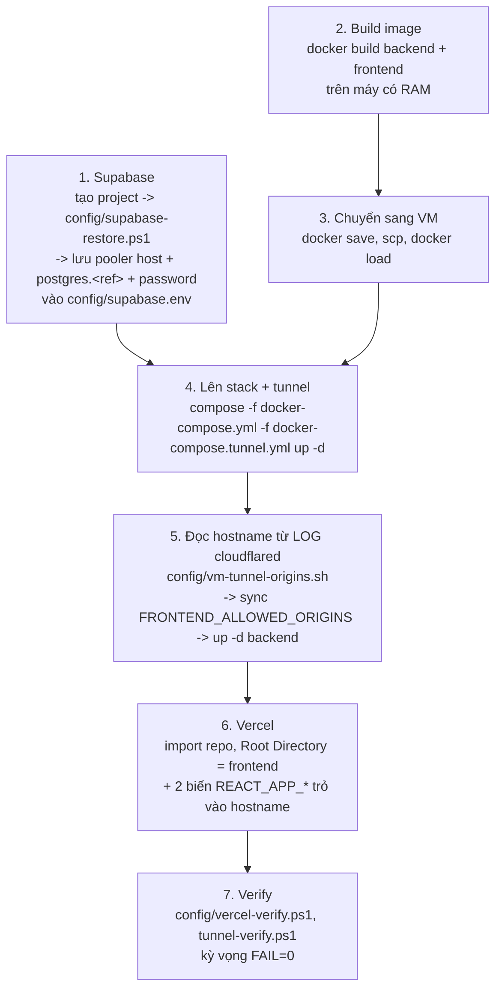

**Thứ tự là bắt buộc.** Hostname tunnel phải tồn tại *trước* khi Vercel build, vì
`REACT_APP_*` nhúng vào bundle và không đọc được lúc runtime. Danh sách origin của
backend thì ngược lại — đọc lúc startup, nên chỉ cần restart.

### Bộ kiểm tra tối thiểu

| Kiểm tra | Kỳ vọng | Nó chứng minh điều gì |
|---|---|---|
| `GET /` và một path vô nghĩa | 200 index.html | SPA fallback hoạt động |
| `GET /api/v1/post` không token | 401 | Spring Security đang chặn |
| `GET /api/v1/account/check?username=admin` | 200, account id 54 | **cả ba tầng** cùng chạy |
| Preflight với `Origin` là host Vercel | 200, `Allow-Origin` khớp đúng, `Allow-Credentials: true` | CORS đúng |
| `GET /ws/info` với `Origin` là host Vercel | 200 | realtime bắt tay được |
| `GET /ws/info` với `Origin: https://evil.example.com` | 403 | allowlist thật sự chặn |
| `GET /actuator/health` từ ngoài | index.html, **không** phải JSON | actuator không phơi ra |
| Cổng 8091, 5433, 8901, 8080, 5432 | đóng hết | override không bị nạp |
| Giá trị **thật** của `REACT_APP_API_URL` trong bundle | hostname tunnel + `/api` | biến môi trường đã tới được build |

Hai dòng cần nói rõ.

`account/check` là **kiểm tra duy nhất chạm cả ba tầng cùng lúc**. Một backend health
"UP" chỉ cho biết datasource đã trả lời, không cho biết dữ liệu có đúng.

Dòng cuối phải đọc **giá trị thật** của biến, không được grep chuỗi con. Phiên bản đầu
của script verify khẳng định "host Vercel không được xuất hiện ở đâu trong bundle", và nó
fail vì `REACT_APP_VERCEL_PROJECT_PRODUCTION_URL` (xem điểm 13). Assertion sai, không
phải deployment sai. Một bài test khẳng định sai thứ còn tệ hơn không có test, vì nó
đốt thời gian và làm mất lòng tin.

---

## 16. Bẫy đã trả giá, để không trả lại

| Bẫy | Biểu hiện | Nguyên nhân |
|---|---|---|
| `cloudflared` bọc trong `sh -c` | "You did not specify any valid additional argument", restart vô hạn | Image là distroless, **không có shell**; cả chuỗi bị truyền làm argv cho cloudflared |
| `docker compose exec -T` trong script chạy qua `bash -s` | Script dừng giữa đường, **exit code 0**, không lỗi | `exec -T` đọc stdin và nuốt phần còn lại của script. Ghi script ra file rồi `bash <file> < /dev/null` |
| Restore dump lên trên schema do init script tạo | 852 lỗi | Dump mang schema riêng. `DROP SCHEMA public CASCADE; CREATE SCHEMA public;` trước, rồi mới restore |
| `npm install --legacy-peer-deps` | Dev server chết: `Cannot find module 'ajv/dist/compile/codegen'` | Bỏ qua peer resolution, để `ajv`/`ajv-keywords` ở major không tương thích. Dùng `--force` |
| `setAllowedOrigins("https://*.vercel.app")` | API chạy, trang tải, **chỉ chat/notification chết** | So khớp nguyên văn; pattern phải qua `setAllowedOriginPatterns` |
| Dùng connection trực tiếp của Supabase | **Treo**, không phải lỗi DNS | Host chỉ có AAAA; VM không có IPv6. Dùng session pooler (IPv4) |
| `up -d` khi chỉ muốn restart backend | Hostname tunnel đổi, Vercel build thành stale | Recreate `cloudflared` cấp hostname mới. Dùng `up -d backend` |
| MCP Postgres server ở `.kiro/settings/mcp.json` | Soi đúng schema nhưng **sai database** | Nó trỏ `localhost:5432` — database của project `vivacon-services` khác, không phải stack compose (5433). Hai cái đang giống nhau và sẽ âm thầm phân kỳ |

---

## Phụ lục: tham chiếu nhanh

```
.kiro/steering/deployment.md     lịch sử deploy + ghi chú vận hành chi tiết
docker-compose.yml               base, an toàn để deploy (chỉ frontend mở cổng)
docker-compose.override.yml      tiện lợi cho dev (mở cổng db/backend + Adminer)
docker-compose.tunnel.yml        cloudflared, phải chỉ định tường minh
Dockerfile                       backend, multi-stage, default profile = prod
frontend/Dockerfile              CRA build -> nginx
frontend/nginx.conf.template     routing /api + /ws, envsubst ${BACKEND_ORIGIN}
frontend/vercel.json             CI=false, npm install --force, SPA rewrite
container/data/*.sql             dump khôi phục được (gitignored)
container/prepare/               schema.sql + stored function + init-db.sh
config/                          script deploy + secret thật (gitignored)
```
